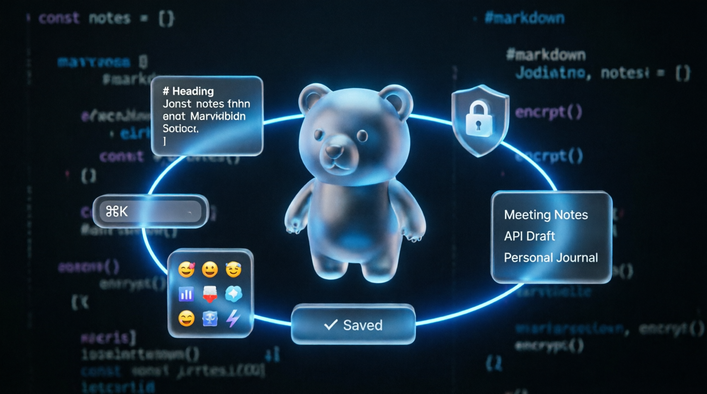

<div align="center">

# 🐻 MD Notes

### End-to-end encrypted, zero-dependency markdown notebook that runs entirely in your browser.
[🚀 Start MD Notes](https://reladevc.github.io/Notes/) • [Download](#quick-start) • 

[](#)
[](#contributing)


</div>

---

## 📖 About

**MD Notes** is a secure, high-performance note-taking application designed with a **privacy-first** architecture. No servers, no tracking, no build steps, no frameworks. Just a single HTML file that keeps your thoughts safe, fast, and accessible anywhere.

> ⚠️ **Zero-Knowledge:** Your password never leaves your device. All encryption and decryption happen exclusively in your browser using the Web Crypto API.

## ✨ Key Features

### 🔒 Military-Grade Security
- **AES-256-GCM Encryption** — authenticated encryption for all stored data
- **PBKDF2 Key Derivation** — 210,000 iterations with SHA-256
- **Atomic Writes** — temp-file strategy prevents data corruption on save
- **Unsaved Changes Guard** — `beforeunload` warning protects against accidental tab closure

### ⚡ Blazing Performance
- **Optimized Canvas Mesh** — ≤24 FPS with automatic idle detection (drops to ~8 FPS)
- **Throttled Interactions** — mouse spotlight limited to 60ms to prevent layout thrashing
- **GPU-Accelerated CSS** — `contain: strict`, `translateZ(0)`, reduced blur radii
- **Accessibility First** — full `prefers-reduced-motion` support

### 📝 Modern Editor
- **Auto-Save** — debounced 1.8s saving with visual status indicators
- **Markdown Rendering** — headings, bold, italic, lists, links, underline
- **Dual Mode** — seamless Edit ↔ Preview toggle
- **Emoji Picker** — built-in selector with cursor-aware insertion
- **Command Palette** — `Ctrl+K` / `⌘K` keyboard-driven navigation
- **Schema Versioning** — automatic data migrations for forward compatibility

### 🌍 Bilingual & Portable
- Full **English / Russian** UI with instant switching
- Encrypted **JSON backup** export/import
- **Single-file deployment** — no npm, no bundler, no server

## 🚀 Quick Start

 Live Version
👉 **[Start MD Notes](https://reladevc.github.io/Notes/)** — instant access, no installation needed.


### Option 3: Clone & Run
```bash
git clone https://github.com/reladevc/Notes.git
cd Notes
# Open index.html in your browser — no build step needed
